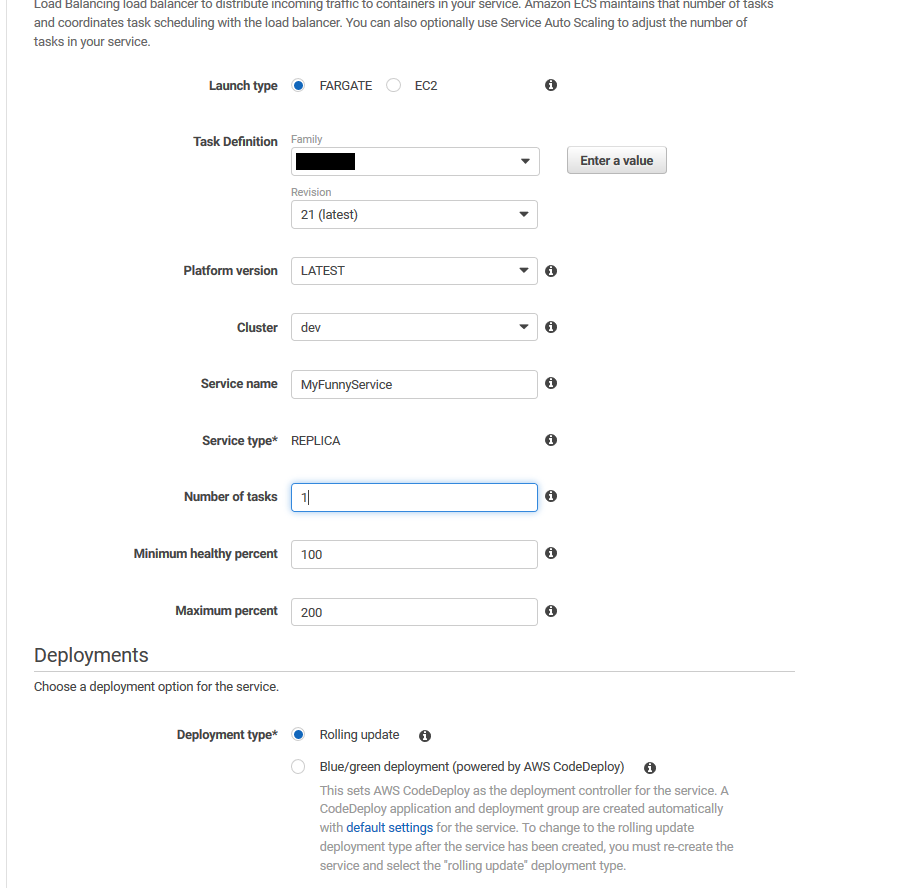

## AWS Rant
AWS can be intimating, there is way too much customization needed to get services up and running. For beginners it will drag them down leaving them in misery for days trying to figure out what is wrong. This is the ultimate networking test for students in college. I don’t care much about AWS, in the sense that I do not want to pursue a career in DevOps, but I like technology and hands on learning so here I am, got to the point in a project where I needed to setup a Node.js server in AWS through HTTPS. As you would expect, I found barely any helpful documentation so I spent hours just messing around with AWS. 
<!--more-->

Some things to keep in mind, I did use Fargate for deployment, just cause it takes a load of the work. EC2 instances are great but I don’t need all that customization and it is a bit harder. Fargate works great but there are extra things you need to get it to work with HTTPS. This guide will go through all the steps, although not all steps are well defined just because I expect you to know it, and they are easy to find online. 

Node.js Server on AWS using Fargate and an HTTPS connection.

## You need a server
I created mine in node.js but any other ones will be fine. Some things to keep in mind, the port of the Container/Server does not reflect on the Host/ELB port. We want the Load Balancer to accept on port 443 which is HTTPS but our server can be any other port, like 5060 or even 80. In my example I will be using port 80 just because it is my only server and it wont conflict. This service will also need to create a Docker Container or Kubernetes. I am using Docker and exposing the port my app will be using. 

Express module - Creation of the server on port
```
  const server = app.listen(8080, err => {
    if (err) {
      logger.error(`Error: ${err}`);
      process.exit(1);
    }
    logger.info(`Listening on port ${server.address().port}`);
  });
```
Package.json - Script that Dockerfile will use to start server
```
  "scripts": {
"start": "nodemon app.js"
}
```

Dockerfile - Container that will run on AWS through ECR
```
FROM node:12.13
WORKDIR /usr/src/app
COPY package*.json ./
RUN npm install
COPY . .
EXPOSE 80
CMD [ "npm", "start" ]
```

These are the base things you need in your Server, mainly just using the correct port that you want AWS to forward traffic to.

## Create ECS Cluster
First thing you want in AWS is to create the ECS Cluster. This is a quick and easy step, which sets up and auto configures a lot of the stuff you will be using throughout. The cluster I choose was Fargate, only because it is quick, easy, and you can still use EC2 with it. So go to ECS and create new cluster using the Fargate template. When creating this cluster do check off “Create VPC” unless of course you will be doing that yourself, its a lot of extra work and if you don’t know what your doing, you may never get it right.

## Create and upload to ECR
The ECR will contain images of the server you have created and be used in creating the AWS Service. So off to the ECR and create a new Repository, naming it what you want. That’s basically it, just copy the URI cause now we need a Task Definition. 

Create a new Task Definition with Fargate, add a name and Task role, Task execution role, I used none for the Task role but default for Task execution role “ecsTaskExecutionRole”. Memory and CPU as you wish, then add that ECR URI in the Container Definitions. Give it a name, image URI, and a mapping, which I have TCP 80 to 80. There is more stuff you can do in here, I left the rest blank, wont be using it now.

All you need now is some way to push you local Server image to this ECR. Your smart you can figure it out. You can use AWS CLI, or some service like GitHub Actions. How ever you do it you need to push the image to Amazon ECR, fill in the new image ID in the task definitions, and by the end of the tutorial, deploy ECS task definition.

## Getting/Registering/Routing a Domain name
For HTTPS calls you need a certificate, which requires your own domain name. Im sure there are ways around this but for the website to be considered “safe” through your browser, you need this stuff. I used AWS for getting a domain name, but other sites will work, just more juggling. 

You can get a domain in “Route 53”, there is nothing tricky here, I believe you can do this yourself. Now that you have a registered domain, you can get a certificate. AWS has a way of doing this under “Certificate Manager”. When you request a certificate, do “DNS validation” and if you used AWS Route 53, it will have a button for you so it will add the entry to your DNS, otherwise just copy and paste what they give you. This might take a while so get some coffee, they say it can be 30+ minutes, mine was about 10.

Lastly you need to associate a static IP to this domain name. Go to EC2 and Elastic IP. Allocate a new one, this will be you new IP, just need to let the DNS know that when a user types your domain in the browser it will use that IP. In Route 53, go Hosted Zones, then to your domain name, Create Record Set. You may want to add a couple of these but I added for the name “HTTPS://www” the type is “A - IPv4 address” and the value is the elastic IP you created. The reason you might need more is cause if you add the name for “HTTPS://www” only then just “www” will not work or “HTTPS://” will not work.

With all that, you should now have a Domain name, an Elastic IP, and they should both be associated with each other. You also have a Certificate which will be used for you ELB.

## Create Load Balancer
I used a Network Load Balancer. The difference between Network and Application Load Balancer is what layer in the OSI model they are on. Application is level 7, and network is level 4. I don’t think this is possible to do with the ALB just because you cannot choose to use the Elastic IP as it is auto assigned. So choose Network Load Balancer.

On the first page, the Schema is “internet-facing” because this will be the entry point of your Domain name. I setup the listener just for port 443, but if you want you can add others. The AZ, choose your VPC that was created with the Cluster, the subnet, and the Elastic IP that's used for your domain. 


Don’t worry this IP in here is not one that I am using anymore, which is why its not covered. On the next page, you will choose the certificate you have created. 

Then you will create a new “Target Group”, the target type will be “IP” unless you are using and EC2 instance, and the rest depends on the service you created. If you did like me and used port 8080, then in the target group Protocol, use TCP, port 80. Under Health Check, if you have one on your service, which you should, but mine is Protocol HTTP and path of “/healthcheck”.

On the Register Targets page, you do not need anything. Yea its confusing but when Fargate will create a new task, it will add it to the Registered Target automatically, and remove when needed. But if your using EC2 instance this is where you would choose it.

## Create and launch Service
Last part is to connect everything together inside the cluster. Back to ECS, and choose your cluster then Create. Main things on the first page is, Launch Type to be Fargate, Task Definition to be the one you created with ECR image. 



Next page, choose the exposed Subnet you used in the Load Balancer, I used us-east-2a. Add a security group, one with HTTP open or what ever port your Server is using. DO NOT USE DEFAULT. I have no idea how or why, but this blocked me for a good hour or more I used default security group and even though it says it allows all traffic inbound, it did not work and I had no idea this was the problem. Choose you Network Load Balancer, give it a health check grace period ~10 seconds. Add the container name, should be the 80:80 mapping. When you set the target group name, the listener port should be “443:TLS” and the health check protocol should set itself to whatever you made before. Next, Next, Done.


