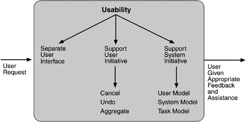

## Thou shall use this guide
### Table of contents  
1. Intro  
2. What defines a Software Architecture  
3. Roles and responsibilities  
4. Service models  
5. Software development approach  
6. Quality Attributes  
7. Architectural development approaches and techniques  
8. Architectural Tactics  
9. Architectural Style  
10. Architectural Patterns  
11. Design patterns  
12. Diagrams  
13. Architectural Analysis  
<!--more-->

## Intro
This is an Architectural cheat sheet for how I conduct business as an Architect. Not everything is a one to one correlation, and not everything will be listed here, but it shall give you an idea of how much work goes into Architecture, while understanding the services that are provided. This can also be useful for anyone getting into Architecture which may need a baseline to start with, and then of course expand and improve my findings. Most of the good stuff on workings day to day basis will be in the section “Architectural development approaches and techniques” but I would advise to at least skim the other sections.

## What defines a Software Architecture
Software architecture consists of 
1. Structure of the system or Architectural style; which is a high level solution to an organizational structure of how the system is formed and interacts with other pieces. 
2. Architecture characteristics or better known as Quality Attributes
3. Architecture patterns; which would define how a particular system is structured and its interactions. MVP, MVVM, DDD, Three-tier, or even noting which layers can communicate or which cannot within a layered style.
4. Design principles; are guidelines for constructing the system such as "All external calls to service A must be REST" but specifics are not mentioned on how to make these calls.

## Roles and responsibilities
First off, design and Architecture are not the same thing, an Architect does design, a designer does not Architect. There are lots of roles out there for Architect, but I as well as much of the community like to use these 3.

1. Enterprise architect - Mainly just a communicator, this person will not be involved in much design, and has an abstract view of the systems integration. They mainly coordinate with stakeholders, Architects, PM’s, and are working on many projects at once.
2. Solutions architect - Designs the core of a single project, most decisions on the project level come from this architect, they focus on solutions. Detailed view of the system integration, and communicate among teams on the project.
3. Application architect - Focus on a single platform, maybe on a domain (mobile, cloud, security, infrastructure, etc). Has a good understanding of the system interactions, but is mainly focused on the application and its design. Typically on a single project.

Unless the company is an Enterprise or has tons of huge projects, a solutions Architect is all that is needed, some very small companies may not even need one. A solutions Architect would then take on roles from the other 2 within reason, they cannot perform domain knowledge in all platforms, nor spend as much quality time in each responsibility, but it will be enough. So the following will be a little more detail of the responsibility of a single Solutions architect at a company.

1. Communication - with customers and/or clients, tech teams, management, sales, stack holders; justifying costs, designs, and decisions; Identifying business requirements and requirements of the stakeholders
2. Design - Design, develop and execute software solutions; choosing the system architecture; architectural reviews; 
3. Software engineer - promote good software engineering practices, such as patterns, testing, documentation, impact of decisions; code reviews; project documentation
4. Technical knowledge - deep understanding of tech domains, evaluate third party tools, track development, new standards, look for exploits
5. Risk management - cautious, evaluating risk with decisions they made, risk mitigation strategies

With those responsibilities some non functional requirements present themselves in a not so obvious way. 
1. Technical constraints - such as the language, platforms, DB, OS, infrastructure, CI pipeline used may not be negotiable by the company. They most likely have people specialized in these fields or use these tech stacks deeply which would make it too expensive and risky to change.
2. Business constraints - The company will impose some new tool or a thing that needs to be done, like adding analytics, accessibility, changing from Google Cloud to AWS, security scan etc.
3. Quality attributes - These are project requirements from the stack holders. An Architect will do an evaluation with them and find these out. QA typically pertains to scalability, usability, security, modafiablity, performance, and so on. In the evaluation the architect will get approximates of what a performant service would mean (like 1000+ calls per second).

The biggest takeaways of an Architect is communication, management, development, design, documentation, risk mitigation, and continuous evaluation of the system.

## Service models
When a new project is taken, the decision might be clear of how this product will sell. Based on that the architect will make decisions based on which service model has been chosen. These are all the “… as a service” types of models. The cloud services models are the most popular and the ones im going to cover. DRaaS or EaaS are just getting nitty and fall into XaaS in my book, they deserve recognition but it feels like they are in someway a type of cloud service. 

#### SaaS - Software as a service
+ Managing - Everything from the networking to the application is managed for the company.
+ Examples - Office 365, Google apps, slack, drop box, AWS, Jira, Cisco WebEx, Github.

#### PaaS - Platform as a service
+ Managing - The company only manages the application and data.
+ Examples - Beanstalk, Heroku, 

#### IaaS - Platform as a service
+ Managing - Application, data, run time, middleware and OS is managed by the company.
+ Examples - AWS, Azure, Rackspace,

#### On-Premises
+ Managing - All responsibilities are manged by the company.
+ Examples - Any company that has all their stuff run on their own personal servers. Amazon using AWS for Amazon shopping.

A good way to see this is by the following Microsoft blog post picture. It shows the models and the correspond covered responsibilities.

  
## Software development approach
### Short:
Domain-driven design (DDD) - Domain is the subject area or “purpose” of the business. This approach puts the main focus of the project on the core domain and logic. The notion behind this is that software would be best developed when the domain is well understood and examined. An architect would spend time with a domain expert to learn terminology and operations around domain problems so that conceptual models can be made. These models will then be presented to platform leads, Senior developers, and anyone else that can provide input if the models can be represented in code for particular platforms. When the models are approved the developers will use the models to turn them into source code, this is called Model-driven architecture (MDA).

### Long:
You are Architecting a new application for a stocks trading company. They are currently doing business by phone, so having an app would be a game changer. First thing you want to do is to talk to every department about how they do business and build a Ubiquitous Language. This language is  the terminology they use in their industry, it might get combined or “dumbed” down so that engineering would understand (some fields use jargon that is beyond understanding). You will use this language and the knowledge gained about the industry to create “Domain models”. You want these models to represent the engineering system to be created as well as the business itself. These models may be excessively large and will probably need to be broken down into smaller pieces. The domain of a stock trading company is trading stocks, but it also involves buying, selling, market pricing,  customer, adding/removing stocks, company stock programs, histograms, predictions, news, etc. The Domain is huge, also depending on how much you want this app to do. When you break it down you are creating a “Bounded Context” around each area, in which this will also break down the information you need to gain in smaller sections. The domain models should use a layered architecture with the layers; UI, Application, Domain, Infrastructure. There are different variations, but most important is having this separation between layers so that changes will not effect beyond its scope or any of its higher levels.

DDD focuses on Domain Model as having and Entity and Value Objects. Entities are unique and do not change such as a person. Value Objects do not have an identity and are immutable (changeable) such as an address. These 2 objects i feel are unneeded and prefer the Clean Architecture for the domain layer where it uses Usecase and Entities. An Entity is a single functional business logic, for a bank it might be "withdrawal cash". A Usecase is combined Entities to form a function, such as the process of withdrawal cash would be "get customer account, get balance, give cash, add atm fee, subtract from balance, print receipt" this would be a single Usecase flow. There is more that these 2 Objects do but that's the premise and i combine it with the use of DDD. It is also important to note that DDD does Domain partitioning which structures the project based on domains and each package of a domain has a presenter, business rules, service and persistence. Clean structures the project with technical partitioning which separates all those layers into their own, downside is that the domain has traces in each package instead of just one as with DDD. In which I do package by feature/domain with a clear Clean layering structure

## Quality Attributes
These are non functional requirements that are used to ensure quality and success of the product, and they come from stakeholders. They define what is acceptable for the product to be considered a success. Each project can and may have different QA, and each attribute may define different areas. There are hundreds of QA’s and more are made up all the time. The QA’s basically define the system and restrict certain design decisions.

Quality Attributes typically follow a post fix of “bility” such examples are; accessibility, deployability, reliability, extensibility, modifiability. There are others which do not follow that convention such as; safety, robustness, effectiveness, accuracy. These terms on their own do not define enough information to start Architecting because what does something like deployability really mean, easy to deploy? Compared to what? We need to define exact measurements so we can compare results and if this QA was achieved. This is done part of the QAW.

## Architectural development approaches and techniques
### ~QAW - Quality Attribute Workshop
In this method the purpose is to identify Scenarios and Quality Attributes needed in the system so that the architect can make a clear decision on designs. The mindset to keep is that the primary focus is on the system, input is based on stakeholders, and this is done before working on the architecture of the system. 

1. QAW Presentation and Introductions - The facilitator will explain each step of this method, the roles and responsibilities of each group, and the outcome. Then the Architects will introduce themselves, the stakeholders will do likewise also informing their role in the project.
2. Business/Mission Presentation - A representative of the stakeholders will present the functionality requirements, constraints, and QA of the system. Facilitators take notes.
3. Architectural Plan Presentation - If this plan exists the technical stakeholder would present it. The facilitators would try to capture plan, strategies, technical requirements, constraints, context diagrams, or any other relative information and diagrams. It is not a requirement for the stakeholders to have this plan, but it does help.
4. Identification of Architectural Drivers - At this step there will be a break for the stakeholders while the facilitators compare notes and create drivers. Architectural drivers include design purpose, QA, functionality, concerns, and constraints. Once the facilitators finish they confirm these drivers with the stakeholders, clarifying and correcting them based on stakeholder input.
5. Scenario Brainstorming - Each stakeholder will be encouraged to create at least 2 scenarios that closely represent their concerns around building the system. Facilitators will walk around and ensure and help with quality of these scenarios and that all the drivers have been included. Once everyone is finished they will round-robin around the table and go over each scenario and document them.

    <b> Types of Scenarios: </b>
    + use case scenarios - involving anticipated uses of the system
    + growth scenarios - involving anticipated changes to the system
    + exploratory scenarios - involving unanticipated stresses to the system that can include uses and/or changes    

6. Scenario Consolidation - Facilitators will try to combine similar scenarios as long as stakeholders agree that the scenarios are identical enough. This will remove repetitive scenarios and be easier to focus with a smaller set.
7. Scenario Prioritization - Each stakeholder will have a number of votes equal to the rounded up even number 30% of the total scenarios available. Then in a round-robin fashion they will each put up a couple votes at a time to the most important scenarios and they will be prioritized accordingly. 
8. Scenario Refinement - Depending on the amount of time available the scenarios are defined in more detail starting with the most priority. Facilitators will discuss and document the following details for each scenario; Business/mission goals affected, QA associated, and a General Scenario.

    <b> General Scenario </b>
    
    + stimulus - the condition that affects the system
    + response - the activity that results from the stimulus
    + source of stimulus - the entity that generated the stimulus
    + environment - the condition under which the stimulus occurred
    + artifact stimulated - the artifact that was stimulated
    + response measure - the measure by which the system’s response will be evaluated

### ~ADD - Attribute-driven design
The ADD method is an approach to defining a software architecture in which the design process is based on the software’s quality attribute requirements. ADD essentially follows a “Plan, Do, and Check” cycle: 

• Plan: Quality attributes and design constraints are considered to select which types of elements will be used in the architecture.  
• Do: Elements are instantiated to satisfy quality attribute requirements as well as functional requirements.   
• Check: The resulting design is analyzed to determine if the requirements are met.   

<b> Inputs: </b>

1. Functional requirement - what functions a system must provide to meet 
stated and implied stakeholder needs when the software is used under specific conditions. (The system shall allow users to buy and sell stocks)
2. Design constraints - decisions about a system’s design that must be incorporated 
into any final design of the system. (The system shall be implemented using Java)
3. Quality attribute requirements - indicate the degrees to which a 
system must exhibit various properties. (performance: The system shall process sensor input within one second)

<b> Outputs: </b>

The design of a system which will describe its roles, responsibilities, properties, and relationships among software elements. Typically shown in forms of Module, Component-and-Connector, and Allocation views. I will not discuss much of these views because I enjoy UML much more for the ease of understanding and building. These diagrams will be described in the UML section.

<b> Steps: </b> 

The steps in ADD are iterative from steps 2-7, so you loop back until the system is complete and satisfied.

1. <b> Review inputs: </b>
    
    There are 5 inputs.
    1. Design purpose - what is the reason that we are designing this service. New product introduced, construction of new service, improving existing service etc.
    2. Primary functional requirements - what are the usecases/functionality we are implementing into the service.
    3. Quality Attribute Scenarios - all the quality attributes requested from stakeholders with a 2 ratings of high, medium, and low impact. One from the stakeholder regarding its importance to business goals, another from the architect based on difficulty of implementation.
    4. Constraint - any and all system, engineering and company constraints which the system must obey.
    5. Architectural concerns - these can slow down progress and would be good to resolve, from the architects point of view.
  
2. <b> Establish iteration goal by selecting drivers: </b>
    
    This step has 2 entry points, either you are designing a system from scratch, or improving an existing system which may have 1 or more elements. You will choose the element by evaluating and prioritizing by size, risk, and importance to business. You would start with the most important driver such as “establishing an overall system structure” in combination with other drivers it may relate. For example the QA’s which may pertain would be performance, and availability.

3. <b> Choose one or more elements in the system to refine: </b>

    If this is a new system, every element would need to be refined. If this is an existing system, take elements that directly pertain to the selected drivers, as other parts of the system will be refined in future iterations.

4. <b> Choose one or more Design Concepts that Satisfies the Architectural Drivers: </b>

    Document the designs chosen, the location, and the rationale behind why. When building a full system there will be many design decisions to document at this step, but when focusing on certain elements it may be just one that gets chosen so its good to also document why one was chosen over another.

5. <b> Instantiate Architectural Elements, Allocate Responsibilities, and define interfaces: </b>

    These will also be documented with the element, its location, and rationale. Some examples would be adding/removing external services, define layers in platform architecture, load balancing, message queue.  

6. <b> Sketch views and record design decisions: </b>

    I like to do UML diagrams but there are lots of other acceptable forms, as long as its understandable. This step is to create diagrams that fit the iteration goals. Along with the diagrams, document each element and its responsibilities that were included in the diagram. In the first iteration of a new system, the high level context diagram would be made with each element being a large overview of a server, or the application itself. In subsequent iterations there will be many diagrams and of different types.

7. <b> Perform Analysis of Current Design and Review Iteration Goal and Achievement of Design Purpose: </b>

    This step is best made with a table that has the columns of; not addressed, partially addressed, completely addressed, design decisions made during the iteration. In which you are addressing which drivers have been satisfied and how.

8. <b> Repeat Steps 2 through 7 for the Next Element of the System You Wish to Decompose: </b>

### ~ATAM - Architecture Tradeoff Analysis Method
Is a quick and inexpensive method to ensure that the Architectural decisions are aliened with the QA requirements. This can be done at any time during development and is a good way to evaluate the current architecture. Outputs you can expect from ATAM is the documentation of; risks and non-risk, tradeoffs, high priority scenarios, architectural approaches, sensitivity points, and attribute specific questions.

1. <b> Present the ATAM </b>

    The evaluation team lead will present the ATAM to the stakeholders, in which they will explain each step,  techniques used, and the expected output.

2. <b> Present Business Drivers </b>

    Project manager will present an overview of the current system from a business perspective summarizing important functional requirements, business goals and context, architectural drivers, constraints, QA, etc. This is so that every would understand the current state and understanding of the project.

3. <b> Present Architecture </b>

    The lead Architect will present the current state of the projects Architecture with a reasonable amount of information, so that it will not be overwhelming nor too much. Present will be technical constraints, system interaction, architectural approaches, high level diagrams, risks, etc.

4. <b> Identify Architectural Approaches </b>

    These approaches are identified by the architect, and captured by the analysis team. They are Architectural Approaches to the problem at hand and steps 1-3 should give enough information to start a possible Architecture. 

5. <b> Generate Quality Attribute Utility Tree </b>

    The evaluation team will work with the architecture team, managers, and leaders, to generate a QA Utility Tree, which helps prioritization specific quality attribute requirements. 

    To create this tree you would start with what QA are required then branch off them into a more specific problem, and finally branch off that into the details of that problem. With the details rankings of high, medium, and low will be done with 2 values. First is the importance of having this QA to the succession of the project, and second is difficulty of achieving.

    

6. <b> Analyze Architectural Approaches </b>

    The Architectural and Evaluation team will analyze the proposed architectures are meeting the QA from the Utility Tree. It is important that they have established an understand the approach, look for weaknesses, sensitivity points, and find tradeoffs with other approaches. The purpose is to find these vulnerabilities so that improvement can be made. The following is a template of an Architectural Approach Documentation which the teams should use as a guideline.

    

7. <b> Brainstorm and Prioritize Scenarios </b>

    This is the same exact brainstorm session as step 5 of QAW so i will not explain that again.  We will compare these prioritized scenarios with the utility tree, ensure the similarities and discuss differences to better understand and establish how to fix the representations. This is a great comparison because the development team does the utility tree with the QA they expect stakeholders to have based on previous discussions, and compare to what stakeholders actually expect with these scenarios.

8. <b> Analyze Architectural Approaches </b>

    This step reiterates step 6 just with the new scenarios from step 7. The main reason for this step is to uncover additional information, and find holes in the proposed Architectural Approaches that are not satisfied by some scenario. It is suggested to repeat steps 4, 5, and 6 till no new information is uncovered.

9. <b> Present Results </b>

    The results will be presented to everyone involved with the architectural approaches documented, set of scenarios and their prioritization, set of attribute-based questions, utility tree, risks and non-risks, the sensitivity points and tradeoff points found.

## Architectural tactics
Techniques/design decisions an architect may use to achieve Quality Attributes and the overall system functionality. For example if a QA is Availability, and from the QAW it was decided that to consider the system Available then “a service should consistently monitor and ensure it is live and operational” would be able to use a “ping/echo” tactic every X seconds with Y continuous failures would result in a restart of the service. There are lots of tactics for each QA and I will not go over them all just because of the amount and that they are available around the web, I will post the images of the most popular one.

## Architectural Style
This is the bread and butter of an Architecture, it is what most people will look at and the most expensive piece to change. The style how the the system interacts and functions as a whole. This explains how each service talks with each other, how to interact with the DB, how external call interacts with the server, etc. There can and will be more than one style used in a project. In this section i will describe a few styles in each category with a short description with some pros and cons. There is no perfect style and each project should be investigated to ensure the best style is used.

<b> Structure </b>

1. Pipes and filters - Stream processing that decomposes a series of jobs into separate elements. Each element takes some input and transforms it based on its own rules then passes to the next element to do the same till it reaches the end and outputs the completed task. A decision tree can be used. 
    + Pros - Simple, easy so use build and understand, maintenance, reuse, concurrent
    + cons - slow, difficult job coordination, coupled, blocking operations
2. Layered - Has multiple layers of abstraction where each layer has its own job and it is specified how data flow works with each other. 
    + Pros - reuse, separation of development, loosely coupled, testable
    + Cons - performance, complexity, scalability
3. Monolithic - single-tiered application in which there is very little separation and most operations and layers are combined into a single program. 
    + Pros - security, performance, scalability, development, deployment
    + Cons - tightly coupled, hard to modify, testing, size, maintenance, relability 

<b> Shared memory </b>

1. Database-centric - The database is at the center of the application where as the business layer and persistence layer are dependent on it 
    + Pros - code reuse, maintenance, 
    + Cons - complexity, high failures, low dependency, expensive
2. Blackboard - Knowledge of the problem exists in a shared resource known as the "blackboard" and consistently gets updated from different "knowledge sources" which stores domain specific knowledge.
    + Pros - scalable, concurrent, reusable
   + Cons - debugging, synchronization, coupling, orchestration

<b> Messaging </b>

1. Event-driven - production, detection, consumption of, and reaction to events which is the communcation path from one service to another. An event can be any identifiable occurrence.
    + Pros - loosely coupled, versitlle, real time analytics, scalable
    + Cons - unknown dependencies, complexity, performace, security
2. Publish-subscribe - Where consumers of messeges "subscribe" to a sender of messages "publishers" so when a publisher pushes a messege it gets distributed to all the consumers that care about it. A publisher can also be a consumer at the same time.
    + Pros - loose coupling, scalable
    + Cons - debugging, reliablility, message delivery issues

<b> Adaptive systems
 </b>

1. Microkernel - Has 2 components, the "core system" and "plugins" where the core holds all the logic of the system to function and any plugin can be added to modify how the system works. Just like the your browers and its extensions. The core system does not care about any of the plugins nor does it need to change any code for the plugins to work, it is the responsability of the plugins to work with the core.
    + Pros - testable, development, security, stability
    + Cons - scalable, performace

<b> Distributed systems
 </b>

1. Space-based
 - The middleware is a controller for the architecture and manages requests, sessions, data replication, distributed request processing, and process-unit deployment. Processing units contains application components such as modules, in memory data grid, asynchronous persistent store. This is just about the duties of a load balancer.

    The messaging grid manages input request and session information. The data grid interacts with the data-replication engine in each processing unit to manage the data replication between processing units when data updates occur. The processing grid manages distributed request processing when there are multiple processing units, each handling a portion of the application. The deployment-manager component manages the dynamic startup and shutdown of processing units based on load conditions.
    + Pros - performance, scaling, deployment
    + Cons - testing, development
2. Service-oriented - A series of distributed services that are self contained, loosely coupled, independent but have a way to communicate with each other. A modern example of an SOA would be a Microservice
    + Pros - loosely coupled, reuse, interoperability, deployment
    + Cons - complex, development, performance, security

Other import and distributed systems to mention is REST and 
Client-server but i feel like these are so well known in the industry that further explanation is not needed and can be easily researched.

## Architectural Patterns
Reusable solution to a common recurring problem in software architecture. Although some patterns may intercept with Architectural Style, the purpose of these patterns are at a lower level and have direct impact on the code base, and the application horizontally or vertically. Some similar ones that are also considered as Styles would be Three-tier, Domain Driven Design, Microkernel, Multilayered. I will go over a couple that we have not noted yet and are extremely popular outside the ones mentioned.

<b> MVC </b>
 
+ Model -> Business logic and controls how the data is created, stored, modified.
+ Controller -> Handles requests from the User by choosing the View to display and getting the data from the Model.
+ View -> The UI that presents data and routes actions to the Presenter.

Multiple views can use one controller. Controller is main. Many Views, one controller, many Models.

<b> Model View Presenter (MVP) </b>

+ Model -> Business logic and controls how the data is created, stored, modified.
+ Presenter -> Handles requests from the View by asking for data from the Model, then modifying the data and gives it back to the View which handles how it is presented.
+ View -> The UI that presents data and routes actions to the Presenter.

Each view has an interface to a presenter. View is main. One View, many Presenters, many Models.

<b> Model View View-Model MVVM </b>

+ Model -> Business logic and controls how the data is created, stored, modified.
+ View-Model -> Handles requests from the View by asking for data from the Model, then modifying the data and updating an observable object which is binded to the View.
+ View -> Binds to actions from the View-Model so when data changes in the View-Model it will fire events for the View to update.

Data binding. ^…^

## Design patterns
There are tons of design patterns used in code, and more are continually being added. Lots of new patterns stay with the company, but initially these patterns are a reusable solution to common programming problems. Without going deep into each pattern, I will just state the commonly known ones with a brief intro to them. This section is not really part of Architecture, although I do find it very valuable to know and understand some of these patterns and keep them in mind when doing reviews and POCs.

<b> Creational (class instantiation) </b>

+ Abstract Factory - Creates an instance of several families of classes
+ Builder - Separates object construction from its representation
+ Factory Method - Creates an instance of several derived classes
+ Object Pool - Avoid expensive acquisition and release of resources by recycling objects that are no longer in use
+ Prototype - A fully initialized instance to be copied or cloned
+ Singleton - A class of which only a single instance can exist

<b> Structural (Class and Object composition) </b>

+ Adapter - Match interfaces of different classes
+ Bridge - Separates an object’s interface from its implementation
+ Composite - A tree structure of simple and composite objects
+ Decorator - Add responsibilities to objects dynamically
+ Facade - A single class that represents an entire subsystem
+ Flyweight - A fine-grained instance used for efficient sharing
+ Private Class Data - Restricts accessor/mutator access
+ Proxy - An object representing another object

<b> Behavioral (Class communication) </b>

+ Chain of responsibility - A way of passing a request between a chain of objects
+ Command - Encapsulate a command request as an object
+ Interpreter - A way to include language elements in a program
+ Iterator - Sequentially access the elements of a collection
+ Mediator - Defines simplified communication between classes
+ Memento - Capture and restore an object's internal state
+ Null Object - Designed to act as a default value of an object
+ Observer - A way of notifying change to a number of classes
+ State - Alter an object's behavior when its state changes
+ Strategy - Encapsulates an algorithm inside a class
+ Template method - Defer the exact steps of an algorithm to a subclass
+ Visitor - Defines a new operation to a class without change

## Diagrams
<b> Structures </b>

Just to go over the basics of Module, Component-and-Connector, and Allocation views. These views are really good and helpful, can be used along with UML. Although I enjoy just UML as it has a lot of diagrams and is more detailed.

+ View – representation of a set of elements and the relations among them
+ Structure - is the set of elements itself 
+ Module – how the system is to be structured as a set of code or data units
+ Component and connector – how the system is to be structured as a set of elements that have run-time behaviors (components) and interactions (connectors)
+ Allocation – how the system will relate to non-software structures in its environment such as (CPU, file systems, networks, development teams)

<b> Module structures </b>

+ decomposition structure
+ uses structure
+ layer structure
+ class
+ data model

<b> C&C structures </b>

+ service structure
+ concurrency structure

<b> Allocation structures </b>

+ deployment structure
+ implementation structure
+ work assignment structure

### Documentation template
<b> Top level template </b>

1. Document control information
2. Documentation roadmap
3. How a view is documented
4. System overview
5. Views
6. Mapping between views 
7. Rationale
8. Directory

<b> View template </b>

1. Primary presentation
2. Element catalog
    1. Elements and their properties
    2. Relations ant their properties
    3. Element interfaces (page 271in design book for template)
    4. Element behavior
3. Context diagram
4. Variability guide
5. Rationale (page 240 in design book for template)

<b> Views and beyond </b>

1. Documentation roadmap
2. How a view is documented
3. System overview
4. Mapping between views
5. Rationale
6. Directory

## UML
For UML I will give just a diagram Type breakdown of all the possible diagrams without going into any detail. These diagrams are easily found and can be investigated further with ease. 3 main types of diagrams, structural, behavioral, and interaction. They are exactly what it sounds like. 

Structural diagrams focus on the structure of the project in any and all areas, from coding, deployment, and security. How are those pieces formed. Behavioral is how the project should behave, it can be a stimulus and response, functionality, or even event behavior. Interaction is technical a part of behavior, just more specific to how it response under circumstances. The following is a list with these 3 types and the diagrams available in each.

1. Structural
    1. Composite Structure Diagram
    2. Deployment Diagram
    3. Class Diagram
    4. Profile Diagram
    5. Package Diagram
    6. Object Diagram
    7. Component Diagram
2. Behavioral
    1. Activity Diagram
    2. Use case Diagram
    3. State machine Diagram
3. Interaction
    1. Sequence Diagram
    2. Communication Diagram
    3. Timing Diagram
    4. Interaction Overview Diagram

Architectural Analysis

Analysis of Structural decay

## Decay indicators
1. Static coupling
2. Temporal coupling 
3. Component size

<b> Macro detection </b>

1. complex and error-prone deployments
2 hard for new people to learn code base
3. code changes take longer than expected

<b> Micro detection - metrics </b>

1. cyclomatic complexity
	+ number of classes
	+ number of lines
	+ notation - max and average
	+ inheritance depth

<b> Analytic decaying tools </b>

1. xray
2. code city

