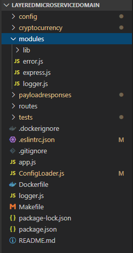
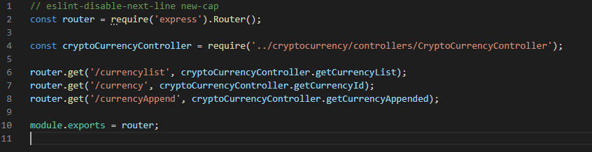
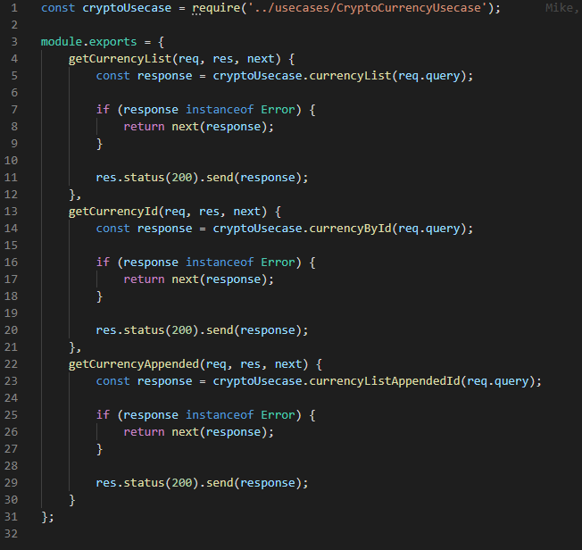
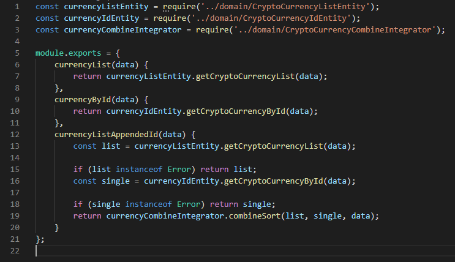
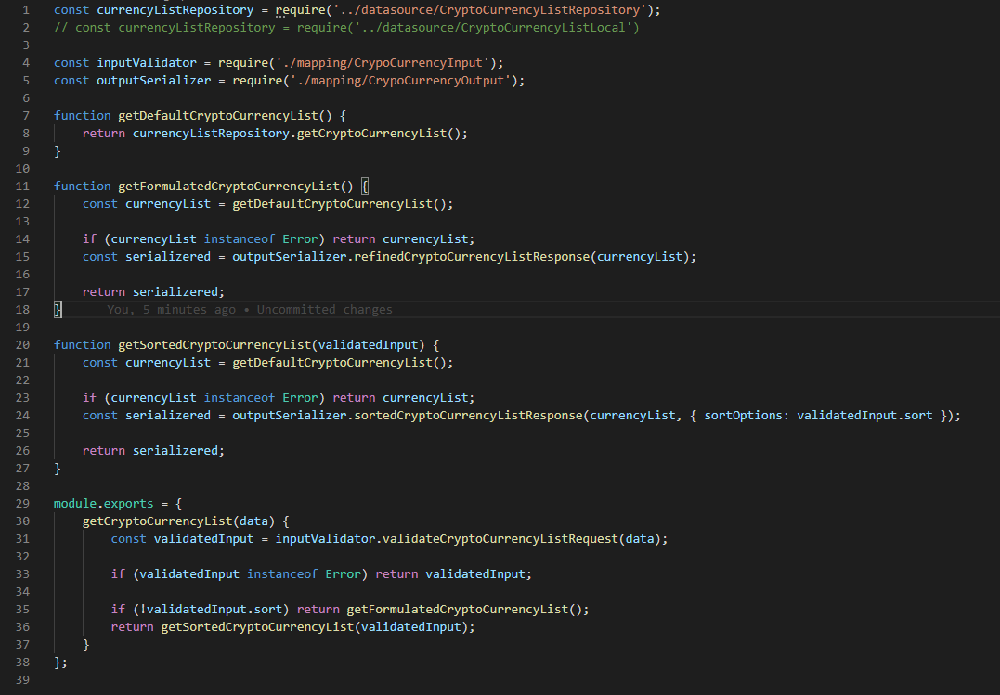
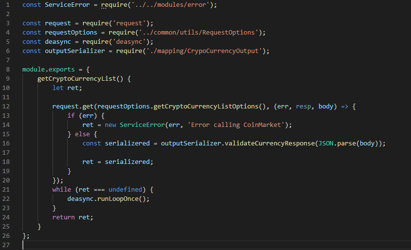
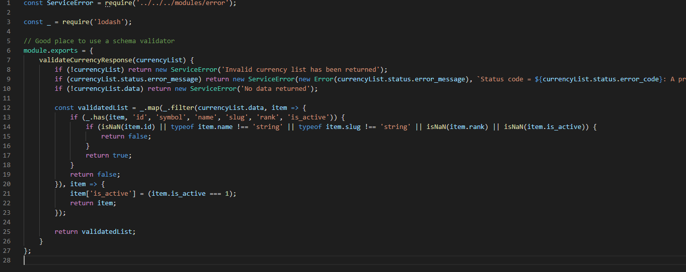
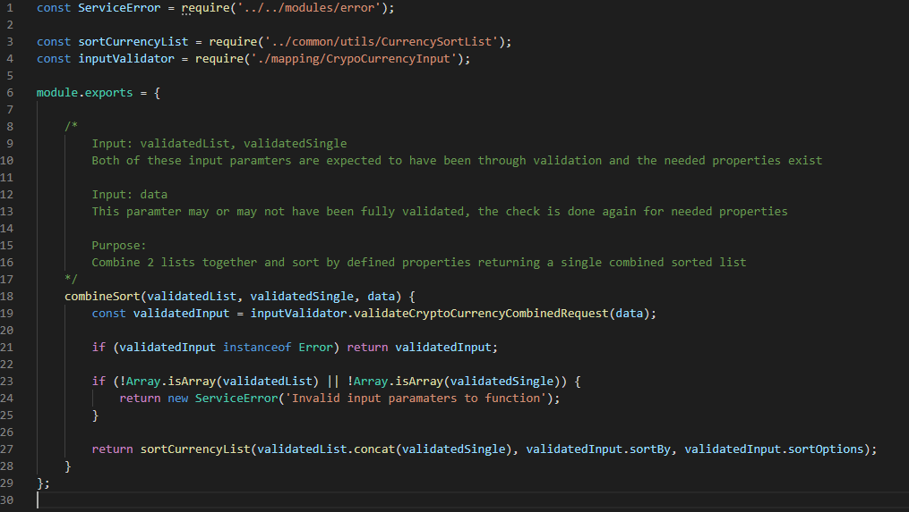

## Architecture with no meaning
This pattern that I have messed around with is based on CLEAN with regards to DDD. Yea sounds weird, CLEAN already is a form of DDD, so you will see some repeats. This first part, I will go over the Architecture of the service, and in the second part I will go over testing strategies. This is a Microservice, and the image is placed in a docker container, commands for building and creating containers exist in the makefile. HTTP calls are done using REST. You may notice there is no OOP in this prototype, your welcome. You can find the project on my github = https://github.com/BigApeWhat/LayeredMicroserviceDomain
<!--more-->

## Package structure
I decided to go with -package by feature- structure. Within each feature you will the controllers, datasource, domain, and usecase. Since this is a microservice there is only one feature, although if the service would regress to an SOA you can add more top level folders for other features. There may be some common files that can be used outside of this feature. When found either extract out to an external package and put in a repo like npm or keep in a top level folder. The commons in this project are in the modules folder, I kept them inside the service. These packages are extremely broad and reusable, so it would be better to put up in a package manager service so that other services can use them.

## Entry point
We have a main route file which is the entry point for all endpoints. This is where the service starts its routing when a user hits a particular endpoint. There are 3 endpoints and each one has a corresponding method in the controller. You may use more than one controller especially if the endpoints are extremely different, but then again this wouldnt be a Microservice, although this Architecture would still be acceptable. I would leave very common and reused routes within one controller.

## Controller
In this file, you have the 3 corresponding methods for each endpoint. Each method calls onto a usecase, gets back a response which will either be an error or success. In this project I did not use many different types of error codes, but if there were common errorcases between each endpoint but messaging would be different, I would have an error mapper in this file and handle the responses from the usecases there. It is also not needed to use a usecase, the first 2 calls are used as a pass through, only the last call has a real usecase. It is acceptable to call straight to the Entity for the first 2 calls. Just keep in mind that readability will be a bit more difficult if some use the usecase and others use an entity. As long as the team is on board its not a problem.  

## Usecase
As you may notice, the Controller and Usecase are practically a one to one, just about a pass through. The usecase will direct the call into the Entity which does all the heavy lifting. Each endpoint has one or more Entities. One thing to note in the Usecase is the call 'currencyListAppendedId' which calls 2 Entities and an Integrator. The 2 entities are reused from the original call, and the Integrator is a new method which basically integrates the 2 entities into a response that is expected from this endpoint.

To avoid duplication in what I am presenting, I will only dig into the 'currencyList' route. 'currencyById' is similar keeping the same patterns. 'currencyListAppendedId' uses the same 2 entities as the previous routes, with the extra Integrator. It is worth checking out the Integrator which I will do at near the end. 

## Entity
This is where all the cool stuff starts, all the work, organization, and planning. You want to make sure the Entity does enough work that you will not need to repeat code if this would be reused elsewhere, but you dont want too much code that it will make it impossible to modify or use in other places without heavy alterations. 

You validate the input here, which would be the endpoint params input, or may even be input that was passed from another Entity (although this is not that case but it is a possibility). The output is formatted here, it does not necessarily need to be the endpoint output response but it can be. It would be wise to keep the output on a broad level so that other would be able to use it if needed.

The last item here is the DataSource. This can be an outbound call, local call, storage, anything that grabs the data you need for this call. Note that there are 2 datasources, one is commented out. I did this to show that even without Inheritance you can still easily swap out the parent. It would still be wiser to use Inheritance but i find this as an acceptable alternative, as you can test it out by using either one in this codebase without any changes to the signature.  

## Input and Output Validation
Not much to be said here, you validate the input, if something is incorrect then return an error. This input validation is your safe guard to the rest of the code, if this passes then you can feel safe about using any of those inputs without having to check if its null, or correct format.

As for the output, you want to make it generic so that the important fields are there and easily used by other routes if needed. You may notice some data mapping happening here, this mapping is for FrontEnd consumption, so they wouldnt have to add this extra logic the server would do it on this level, its the 'presentation mapping'. This mapping might also be needed for other routes, and I have created that example of how, in the Integrator. 

## DataSource
The last part, this is where all the data will come from. This the lowest level and the least amount of modification should be done here. You make the request, validate basic input, send the response back to the Entity. This is where you make sure that the params that should be required are there, data is in correct formats, everything and anything that will be used is correct so that when any higher level gets this response it does not need to do any checks on the validity. 

There is a small mapping here, this is an entry mapping, which is needed for other routes, so if only the datasource would be used and not the Entity associated, then we would want at least this minimum mapping to happen.

## Integrator
Basically this integrator is used to combine the response of 2 very specific responses, and return its own response. Small validation is done here to ensure the data it has is acceptable for the combination.
