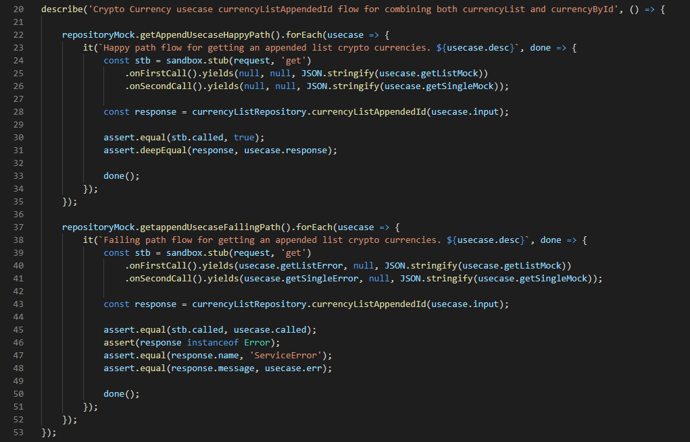

## Architecture with no safety
This is the second part of a 2 part series. In this section I will go over the testing suite that was used in this Service. These tests might go over and beyond what most companies would do, if you find this to be true, just keep in mind that I hate testing, and this is what I would consider a starting point for a proper testing suite. Lack of tests is a result of a dev with too much ego in his work, but you wont recognize your code months later, and there will always be a dev that makes a breaking change. Proper test coverage gives us the ability to find that quickly and early, even before the merge is done. You can find the project on my github = https://github.com/BigApeWhat/LayeredMicroserviceDomain
<!--more-->

## Package structure
All the tests are under the 'tests' folder. There are 6 types of tests. Unit, Component, and Integration are local mocked tests. The 'endToEnd' tests have 3 sections, Schema, Status and Service which will hit external sources and mimic as they would run in production.

## Unit, Component and Integration
These tests do not reach out to external services everything is mocked, they test within their reach, they are quick and part of the CD pipeline. 

Unit will tests single functions and/or functions that have high Coupling. Any function call within the tested function will be mocked, tests should check just the output based on what the input was. Technically 1 assertion per test is enough, personally there is no big issue if there is more as long as its minimal. 

Component will tests a small flow that has combined methods which work together to give a more accurate response. This is where you will start to see some duplication in tests, although I havent written any of these, but things that you would test here are "currencyList" and "currencyById". Another way to look at it is that its an Entity test.

Integration will tests the full suite of an endpoint from start to finish, although external calls are mocked, but all the internal calls will be true in value. For the full flow, I chose to start in the Usecase, sure the controller is at a higher level, I just didnt find any value starting from there since it was all covered in a unit test. Also, the controller may change drastically, testing from the Usecase it give less chance of change in the future and less rewritten tests.
 

Most tests are setup that each method is wrapped in a for loop, allowing me to give tons of different inputs and tell it what the output should be. The mocks file will provide the list of 'happy, failing, neutral' paths for each method, Not all tests will have or need a neutral path. Within that list, there will be the 'inputs, outputs, and mocked external responses'. Some tests may not have this for loop but just single standoff tests, which if you dont repeat yourself too much, its fine. The point here is readability. 

## End to End
All 3 of these will hit externally and will not run in the CD pipeline. The reason for this 'internal vs external' separation of tests is that we dont want inconsistency in failing network tests blocking PR's getting merged. These tests will not even be in the service, they will be in an external monitoring tool which runs these tests (maybe as a cron job) every X minutes and reports on the health of each endpoint. These tests will only hit this service directly, it shouldnt test the external endpoints (CoinMarketCap). You may notice that "MarketCapEndpointStatusValidation.test" hits CoinMarketCap directly, this is just an extended example of the status codes that can be returned since my service lacks them, but you would never do this in a real test suite. 

StatusCheck tests all the possible status codes for each endpoint. We want to call our service with data that will give a specific statusCode, ensuring that status handling within the service is always working. Use as many variations as you can, without repeating the flow.
 

Schema tests exactly that, the Schema of the response from our service. This is a safe guard to make sure our changes will not break anyone who is using the API and spotting a breaking schema change early. Ensure that all schema possibilities are tested, in which every optional, every required value for each endpoint is checked in at least one test. Yes, there is a lack of schema testing in my example, good practice for you to improve it.
 

Service tests are basically Integration tests but with all the external calls. We just want to test and make sure that for some data we get the expected output. This is a full E2E test of each endpoint. 
 